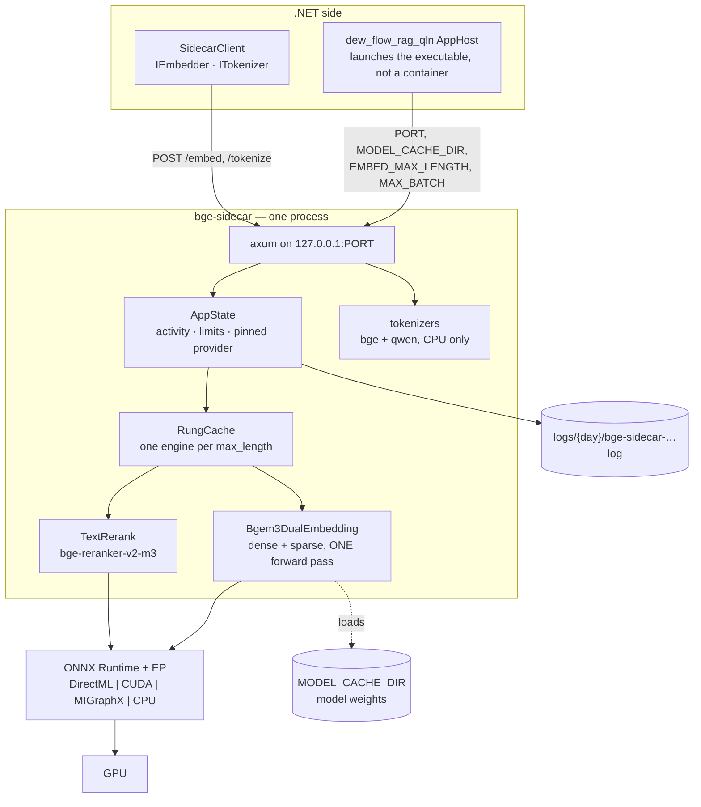
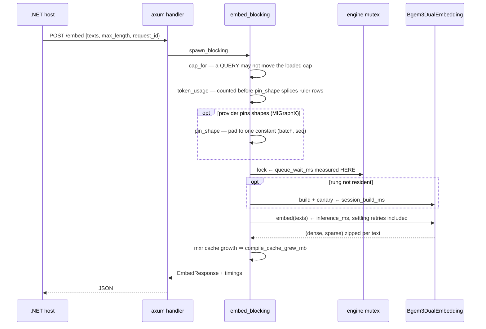

# Architecture — dew_flow_sidecar_rust (bge-sidecar)

> The system **as it is**, 2026-08-15. Everything below is in the repository today; what is planned but
> absent is listed in [What does not exist yet](#what-does-not-exist-yet). Open work lives in
> [../todo/](../todo/).

## What this is

A single-binary **HTTP embedding and reranking service** in Rust, serving BGE-M3 on the machine's GPU.
It exists because the .NET side cannot do three things: run ONNX on a local accelerator, produce a
learned-sparse vector, and count tokens with the model's own tokenizer.

The constraint that shapes everything: **the ONNX Runtime execution provider is a compile-time feature,
and the vendor providers may be used but never redistributed.** There is no fat binary that works
everywhere. The customer's machine builds the flavour it needs.

- **Style** — one process, one HTTP surface, one lazily-built model session per shape, guarded by a
  mutex. No database, no queue, no background work.
- **Stack** — Rust, `axum` 0.8 + `tokio`, `fastembed` (vendored with one patch), `ort` (ONNX Runtime),
  `tokenizers`, `tracing`.
- **Execution providers** — DirectML (default feature), CUDA, MIGraphX, CPU. Selected at **build** time;
  `ORT_PROVIDER` only chooses among the ones compiled in.
- **Layout** — `src/main.rs` (~2 800 lines: config, state, engine cache, handlers, inference, preflight,
  logging), `src/adapters.rs` (DXGI device resolution, Windows-only), `vendor-fastembed/` (a full
  vendored copy carrying one marked patch).

## Containers

## The HTTP surface

| Route | Body | Answer |
|---|---|---|
| `GET /health` | — | status, activity, requested/compiled/active provider, `provider_ready`, last provider error, exe and runtime-manifest hashes, loaded models, limits, DXGI adapter |
| `POST /embed` | `texts[]`, `kind`, `provider?`, `max_length?`, `max_batch?`, `request_id?` | `dense[][]`, `sparse[]`, token accounting, `request_id`, `timings` |
| `POST /rerank` | `query`, `documents[]`, `provider?`, `max_batch?`, `request_id?` | `scores[]` in input order, `request_id`, `timings` |
| `POST /tokenize` | `texts[]`, `model` (`bge` \| `qwen`) | `token_count[]`, `model`, `available` |
| `POST /unload` | `{}` \| `{embed_max_lengths[], rerank}` | the `/health` body, after dropping engines |

No authentication, no CORS, no protocol versioning. It binds `127.0.0.1` and is a local compute service.

## One embed, end to end

## Cross-cutting concerns

### Timings on the wire

`/embed` and `/rerank` answer with `timings`: `queue_wait_ms`, `session_build_ms`, `inference_ms`,
`compile_cache_grew_mb`. Queue wait is measured **around the engine mutex only** — a request that waited
eight seconds behind another caller's pass and then ran 400 ms used to look, to its caller, like a slow
model. Design record: [PLAN_response_timings.md](PLAN_response_timings.md).

### Token accounting

Truncation here is **silent**: an input longer than `max_length` is cut to a prefix and embedded as
though the prefix were the whole text. So `/embed` returns per-text `token_count` and `truncated`, and
`token_accounting: false` means *not measured* — the caller must not read "no truncation reported" as
"nothing was truncated". Measured on an R9700: real source tokenizes at 2.99–3.50 chars/token, so a host
budgeting 4 chars/token overshoots by ~34 % and loses the tail of every text it fills.

### Provider selection, and what `/health` really says

The provider of the first successful session is **pinned until restart**. `/health` separates four
things that a single `provider` field conflated: what was *requested*, what the binary was *compiled*
with, what is *active*, and the last registration *error*. A provider absent from `compiled_providers`
can never become active however it is configured — the failure is in the build flavour, not the
settings. `exe_sha256` and `runtime_manifest_sha256` exist so a benchmark can prove it measured the same
binary: an installed sidecar older than its commit is invisible to every other field.

### Shape pinning and the settling retry

Both are worked around one execution provider. MIGraphX recompiles per distinct input shape — measured
~2–4 minutes and ~2.5 GB of on-disk cache each — so `PIN_INPUT_SHAPE` (on by default under MIGraphX)
splices "ruler" rows to force one constant shape. The same provider test gates `embed_settling`: the
first `session.run` on a freshly built MIGraphX session returns a short batch, and the re-run settles
it. Measured 2026-07-28 at `(64, 1024)`: dense returned 80 rows for a 128-row input.

### The engine cache

`RungCache` holds one engine per `max_length`, least-recently-used eviction, capacity from
`EMBED_ENGINE_CACHE_RUNGS` (default 2). A Fast lane walks the ladder down and back up, crossing the
boundary twice per pass; before the cache each crossing evicted both engines — ~5.5 minutes per pass,
forever.

### Logging

`tracing` with two layers: stdout **with** ANSI, and a file **without**, at
`{SIDECAR_LOG_DIR}/{day}/bge-sidecar-device{id}-{HH-mm-ss}-{pid}.log`. UTC throughout, level from
`RUST_LOG`. The contract mirrors the .NET family rule
(`.claude/rules/common/logging-serilog.md`) — same path shape, same file-per-run.

### Error handling

Handler failures become `ApiError` — a status plus `{ "error": … }`. An unknown tokenizer name is a
`400` rather than a silent answer from the wrong tokenizer, because a count from the wrong model is
worse than no count. A poisoned engine mutex is healed by dropping every resident engine and rebuilding.

### CI

`.github/workflows/` builds the crate. There is **no `cargo fmt` gate**: the checkout carries ~109
pre-existing rustfmt diffs, and the gate is open work in
[../todo/PLAN_sidecar_product.md](../todo/PLAN_sidecar_product.md).

## Modules

| Document | Covers |
|---|---|
| [module_inference.md](module_inference.md) | The engines, the cache, shape pinning, the timing spans |
| [module_http_surface.md](module_http_surface.md) | Every route, its wire shape, and what each field promises |
| [module_runtime_preflight.md](module_runtime_preflight.md) | Config, provider resolution, DXGI mapping, startup checks |

## What does not exist yet

- **No metrics endpoint** (no Prometheus, no OpenTelemetry) and no `#[instrument]` spans. Every timing
  is a manual `Instant`.
- **No live GPU telemetry.** `adapter.vram_mb` is DXGI's static capacity sampled once at startup;
  `mxr_cache_mb` is disk usage of the compiled-program cache, not memory.
- **No queue-depth signal.** Concurrency is implicit in mutex contention, and `/health` deliberately
  uses `try_lock` so it never queues behind model work — which also means it cannot report the depth.
- **No request body limit is set**, so every route runs on axum's default 2 MB. Measured: 980 KB to
  `/tokenize` succeeds, 2.1 MB returns `413`. The host now batches under it; the cap is not stated in
  `/health`, and saying so is open work.
- **No integration test suite** — testing is inline `#[cfg(test)]` in `main.rs` and `adapters.rs`
  (51 tests).
- **Distribution is not built**: no build-recipe-as-data, no self-verification gate, no LICENSE or
  third-party notices.
