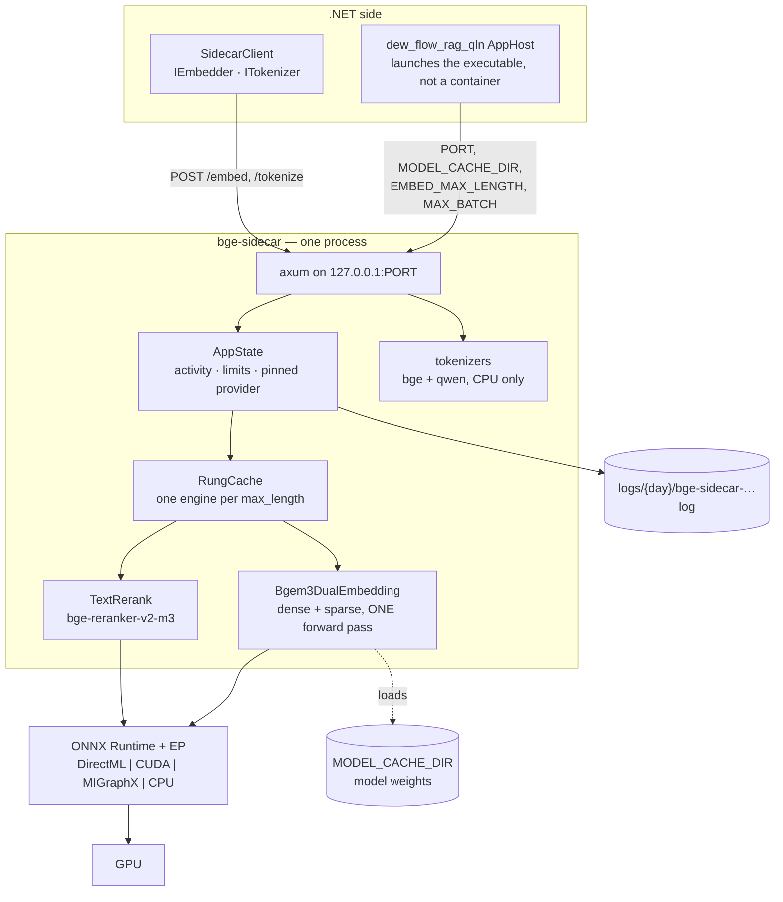

# Architecture — dew_flow_sidecar_rust (bge-sidecar)

> The system **as it is**, 2026-08-15. Everything below is in the repository today; what is planned but
> absent is listed in [What does not exist yet](#what-does-not-exist-yet). Open work lives in
> [../todo/](../todo/).

## What this is

A single-binary **HTTP embedding and reranking service** in Rust, serving BGE-M3 on the machine's GPU.
It exists because the .NET side cannot do three things: run ONNX on a local accelerator, produce a
learned-sparse vector, and count tokens with the model's own tokenizer.

The constraint that shapes everything: **the ONNX Runtime execution provider is a compile-time feature,
and the vendor providers may be used but never redistributed.** There is no fat binary that works
everywhere. The customer's machine builds the flavour it needs.

- **Style** — one process, one HTTP surface, one lazily-built model session per shape, guarded by a
  mutex. No database, no queue, no background work.
- **Stack** — Rust, `axum` 0.8 + `tokio`, `fastembed` (vendored with one patch), `ort` (ONNX Runtime),
  `tokenizers`, `tracing`.
- **Execution providers** — DirectML (default feature), CUDA, MIGraphX, CPU. Selected at **build** time;
  `ORT_PROVIDER` only chooses among the ones compiled in.
- **Layout** — `src/main.rs` (~2 800 lines: config, state, engine cache, handlers, inference, preflight,
  logging), `src/adapters.rs` (DXGI device resolution, Windows-only), `vendor-fastembed/` (a full
  vendored copy carrying one marked patch).

## Containers



## The HTTP surface

| Route | Body | Answer |
|---|---|---|
| `GET /health` | — | `status` (`ok` \| `wedged`), activity, `in_flight[]`, `wedged`, requested/compiled/active provider, `provider_ready`, last provider error, exe and runtime-manifest hashes + `provenance_ready`, loaded models, limits, DXGI adapter |
| `GET /models` | — | one row per model or registered tokenizer: `id`, `name`, `kind` (`dense+sparse` \| `rerank` \| `tokenizer-only`), `dimension` (measured, `null` = unknown), `max_sequence_length`, `tokenizer`, `available` (the engine), `tokenizer_available` (the file) |
| `POST /embed` | `texts[]`, `kind`, `provider?`, `max_length?`, `max_batch?`, `request_id?` | `dense[][]`, `sparse[]`, `dimension`, token accounting, `request_id`, `timings` |
| `POST /rerank` | `query`, `documents[]`, `provider?`, `max_batch?`, `request_id?` | `scores[]` in input order, `request_id`, `timings` |
| `POST /tokenize` | `texts[]`, `model` (any registered tokenizer; `bge` by default) | `token_count[]`, `model`, `available` |
| `POST /unload` | `{}` \| `{embed_max_lengths[], rerank}` | the `/health` body, after dropping engines |

No authentication, no CORS, no protocol versioning. It binds `127.0.0.1` and is a local compute service.

## One embed, end to end

```mermaid
sequenceDiagram
    participant H as .NET host
    participant A as axum handler
    participant B as embed_blocking
    participant M as engine mutex
    participant E as Bgem3DualEmbedding

    H->>A: POST /embed {texts, max_length, request_id}
    A->>B: spawn_blocking
    B->>B: cap_for — a QUERY may not move the loaded cap
    B->>B: token_usage — counted before pin_shape splices ruler rows
    opt provider pins shapes (MIGraphX)
        B->>B: pin_shape — pad to one constant (batch, seq)
    end
    B->>M: lock_or_refuse  ← queue_wait_ms measured HERE; 503 if the holder is wedged
    opt rung not resident
        B->>E: build + canary  ← session_build_ms
    end
    B->>E: embed(texts)  ← inference_ms, settling retries included
    E-->>B: (dense, sparse) zipped per text
    B->>B: mxr cache growth ⇒ compile_cache_grew_mb
    B-->>A: EmbedResponse + timings
    A-->>H: JSON
```

## Cross-cutting concerns

### Timings on the wire

`/embed` and `/rerank` answer with `timings`: `queue_wait_ms`, `session_build_ms`, `inference_ms`,
`compile_cache_grew_mb`. Queue wait is measured **around the engine mutex only** — a request that waited
eight seconds behind another caller's pass and then ran 400 ms used to look, to its caller, like a slow
model. Design record: [PLAN_response_timings.md](PLAN_response_timings.md).

### Token accounting

Truncation here is **silent**: an input longer than `max_length` is cut to a prefix and embedded as
though the prefix were the whole text. So `/embed` returns per-text `token_count` and `truncated`, and
`token_accounting: false` means *not measured* — the caller must not read "no truncation reported" as
"nothing was truncated". Measured on an R9700: real source tokenizes at 2.99–3.50 chars/token, so a host
budgeting 4 chars/token overshoots by ~34 % and loses the tail of every text it fills.

### The wedge detector — the ceiling on this file's one uncancellable wait

An ONNX Runtime forward pass **cannot be cancelled**: it is a C++ call on a thread this process does not
own, and a thread merely *stuck* inside it never panics — so the poison healing, which recovers a mutex a
*panic* poisoned, can never reach it. Until 2026-08-16 nothing else could either: every later `/embed`
queued on `.lock()` forever, `/health` reported the freeze exactly as it reports a healthy multi-minute
build, and the daemon's deliberately infinite sidecar HTTP timeout composed the two into a system-wide
freeze nobody could observe.

The remedy is visibility plus a ceiling, not cancellation:

| Piece | What it does |
|---|---|
| `InFlight` + `InFlightStamp` | The holder stamps *what* it is doing and *since when*, in a mutex of its own — never inside the engine slot, because a holder wedged under that mutex could not be observed through it. RAII, so `?` and panics clear it |
| `lock_or_refuse` | Every engine acquisition. Heals poison as before, waits while the holder is legitimately alive, and **refuses** — `503`, not `500` — once the holder passes its ceiling |
| `/health` `status` / `wedged` / `in_flight[]` | The verdict, the elapsed time, the phase and the activity, all readable while the wedge is happening |
| `spawn_wedge_watchdog` | Says it in the **log**, once per wedge — the party that would otherwise have asked `/health` is the one already blocked |

The ceilings are deliberately generous, because a false "wedged" is expensive in both directions: a
first-ever MIGraphX shape compile is **minutes of correct slowness** (214 s measured), and killing a
process mid-compile is exactly how a corrupt `.mxr` lands in the cache — the 2026-07-31 incident the
canary exists for. So `building` gets 3600 s, `running` 900 s (~1.5× the slowest honest pass on record),
and the process-exit last resort is **opt-in** (`WEDGE_EXIT`) and **off**.

### Provider selection, and what `/health` really says

The provider of the first successful session is **pinned until restart**. `/health` separates four
things that a single `provider` field conflated: what was *requested*, what the binary was *compiled*
with, what is *active*, and the last registration *error*. A provider absent from `compiled_providers`
can never become active however it is configured — the failure is in the build flavour, not the
settings. `exe_sha256` and `runtime_manifest_sha256` exist so a benchmark can prove it measured the same
binary: an installed sidecar older than its commit is invisible to every other field. Both are hashed
**at startup on the blocking pool**, never on the probe path — the first `/health` used to compute them
inline (measured 1.4 s over 67 MB of test binaries; a CUDA install is gigabytes), and `provenance_ready`
is the field that distinguishes "not hashed yet" from "unreadable".

### Shape pinning and the settling retry

Both are worked around one execution provider. MIGraphX recompiles per distinct input shape — measured
~2–4 minutes and ~2.5 GB of on-disk cache each — so `PIN_INPUT_SHAPE` (on by default under MIGraphX)
splices "ruler" rows to force one constant shape. The same provider test gates `embed_settling`: the
first `session.run` on a freshly built MIGraphX session returns a short batch, and the re-run settles
it. Measured 2026-07-28 at `(64, 1024)`: dense returned 80 rows for a 128-row input.

### The engine cache

`RungCache` holds one engine per `max_length`, least-recently-used eviction, capacity from
`EMBED_ENGINE_CACHE_RUNGS` (default **1** — `src/main.rs:149`; this document said 2 until 2026-08-15, and 1 is the value that reproduces the pre-cache behaviour, so the two-rung ladder is opted IN rather than shipped). A Fast lane walks the ladder down and back up, crossing the
boundary twice per pass; before the cache each crossing evicted both engines — ~5.5 minutes per pass,
forever.

### Logging

`tracing` with two layers: stdout **with** ANSI, and a file **without**, at
`{SIDECAR_LOG_DIR}/{day}/bge-sidecar-device{id}-{HH-mm-ss}-{pid}.log`. UTC throughout, level from
`RUST_LOG`. The contract mirrors the .NET family rule
(`.claude/rules/common/logging-serilog.md`) — same path shape, same file-per-run.

### Error handling

Handler failures become `ApiError` — a status plus `{ "error": … }`. An unknown tokenizer name is a
`400` **naming every registered one**, rather than a silent answer from the wrong tokenizer, because a
count from the wrong model is worse than no count — and a refusal that lists the alternatives is the
difference between a caller guessing and a caller correcting itself. A *registered* name whose file is
missing is not that error: it answers `200` with `available: false`, because the caller was right and the
deployment is what is incomplete. A poisoned engine mutex is healed by dropping every resident engine and rebuilding.
A **wedged** engine — held past its ceiling by an uncancellable ORT call — is a `503` carrying the
holder's activity and elapsed time, because nothing is wrong with the request and a host that degrades on
`503` while treating `500` as a hard failure can only act on the difference if it is made.

### CI

`.github/workflows/` builds the crate. There is **no `cargo fmt` gate**: the checkout carries ~109
pre-existing rustfmt diffs, and the gate is open work in
[../todo/PLAN_sidecar_product.md](../todo/PLAN_sidecar_product.md).

## Modules

| Document | Covers |
|---|---|
| [module_inference.md](module_inference.md) | The engines, the cache, shape pinning, the timing spans |
| [module_http_surface.md](module_http_surface.md) | Every route, its wire shape, and what each field promises |
| [module_runtime_preflight.md](module_runtime_preflight.md) | Config, provider resolution, DXGI mapping, startup checks |

## What does not exist yet

- **No metrics endpoint** (no Prometheus, no OpenTelemetry) and no `#[instrument]` spans. Every timing
  is a manual `Instant`.
- **No live GPU telemetry.** `adapter.vram_mb` is DXGI's static capacity sampled once at startup;
  `mxr_cache_mb` is disk usage of the compiled-program cache, not memory.
- **No queue-depth signal.** Concurrency is implicit in mutex contention, and `/health` deliberately
  uses `try_lock` so it never queues behind model work — which also means it cannot report the depth.
  `in_flight[]` names what *holds* each engine, which is a different question from how many wait.
- **No request body limit is set**, so every route runs on axum's default 2 MB. Measured: 980 KB to
  `/tokenize` succeeds, 2.1 MB returns `413`. The host now batches under it; the cap is not stated in
  `/health`, and saying so is open work.
- **No integration test suite** — testing is inline `#[cfg(test)]` in `main.rs` and `adapters.rs`
  (62 tests).
- **Distribution is not built**: no build-recipe-as-data, no self-verification gate, no LICENSE or
  third-party notices.
