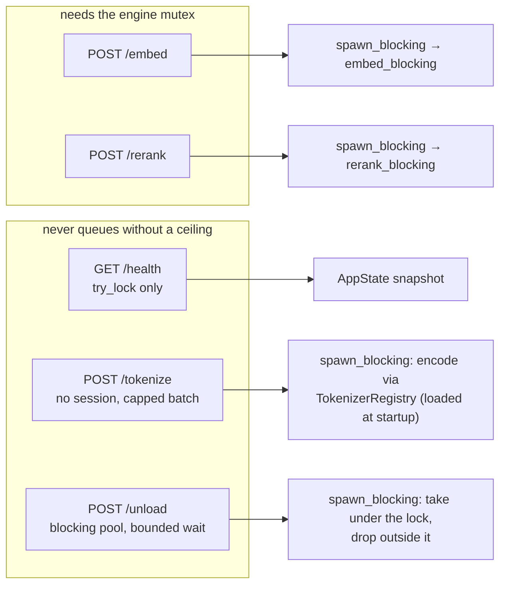

# Module — HTTP surface

> `src/wire.rs` (the request/response records), `src/introspection.rs` (`/health`, `/models`,
> `/unload`) and `src/handlers.rs` (`/embed`, `/tokenize`, `/rerank`). The system as it is, 2026-08-16.

## Purpose

Be the whole API of this process — five routes, JSON in and out, on loopback — and make every answer say
what it does **not** know as clearly as what it does.

## Routes



## Wire shapes

### `POST /embed`

```jsonc
// request
{ "texts": ["…"], "kind": "doc" | "query", "provider": "auto|cuda|dml|migraphx|cpu",
  "max_length": 0, "max_batch": 0, "request_id": "" }

// response
{ "dense": [[0.1, …]], "sparse": [{ "indices": [u32], "values": [f32] }], "dimension": 1024,
  "token_count": [123], "truncated": [false], "max_length": 256, "token_accounting": true,
  "request_id": "", "timings": { "queue_wait_ms": 0, "session_build_ms": 0,
                                 "inference_ms": 0, "compile_cache_grew_mb": 0 } }
```

`kind` is accepted for contract compatibility — BGE-M3 embeds queries and documents identically — but a
`query` is never allowed to move the loaded sequence cap, because it arrives interleaved with index
passes.

`dimension` is the width of the dense rows **in this same response**, read from one of them — free, since
it is the length of a row already computed, and it removes the last model constant a caller had to know
in advance. A vector store creating a collection from the response it is holding cannot then create it at
the wrong width. `null` for an empty batch: never `0`. The pinned path re-measures it from the rows that
actually leave rather than carrying the padded batch's number over.

### `POST /rerank`

`{ query, documents[], provider?, max_batch?, request_id? }` → `{ scores[], request_id, timings }`.
Scores are sigmoid-normalised to 0…1 and returned **in document order**: `rerank()` returns them sorted
by score, while the C# consumer pairs by position.

### `POST /tokenize`

`{ texts[], model }` → `{ token_count[], model, available }`. No session and no GPU, which is what makes
it safe to call from inside an index pass — it never queues behind the card.

`model` resolves through the **tokenizer registry** (`TokenizerRegistry`, built once at startup), not a
string match: `bge` (default when the field is absent) and `qwen` today, and a third model is a row plus a
path rather than a code change. Three refusals, and they are deliberately different answers:

| Situation | Answer |
|---|---|
| A name this build does not register | `400`, **naming every registered row** so the caller can correct itself |
| A registered name whose file is absent or unparseable | `200`, `available: false`, empty array — the name was right, the deployment is missing something |
| The tokenizer **refuses** one of the texts | the same `available: false` — a `0` a caller cannot tell from an empty text is worse than an honest "not measured" |
| More than `TOKENIZE_MAX_TEXTS` texts | `400` naming the cap — the encode is CPU work and the body limit does not bound the row count |

The encode itself runs inside `spawn_blocking`, as `/embed`'s always has: "pure CPU" is a claim about the
GPU, not about the async runtime, and a batch of ten thousand encodes in front of the reactor stalls
`/health` and `/unload` — the two endpoints an operator reaches for when something is stalled.

### `GET /models`

What this build can embed with, rerank with and count with — one read, so a consumer can validate a
corpus recipe **before** starting a pass instead of discovering a mismatch in the middle of one. Answered
without touching an engine lock (`loaded_now` try_locks, exactly as `/health` does).

```jsonc
{ "models": [
  { "id": "bge-m3", "name": "BAAI/bge-m3 (dense+sparse heads, FP32, one session)",
    "kind": "dense+sparse", "dimension": null, "max_sequence_length": 256,
    "tokenizer": "bge", "available": false, "tokenizer_available": true },
  { "id": "bge-reranker-v2-m3", "name": "bge-reranker-v2-m3", "kind": "rerank",
    "dimension": null, "max_sequence_length": 1024,
    "tokenizer": null, "available": false, "tokenizer_available": null },
  { "id": "qwen", "name": "qwen", "kind": "tokenizer-only",
    "dimension": null, "max_sequence_length": null,
    "tokenizer": "qwen", "available": false, "tokenizer_available": false } ] }
```

- **`kind`** is `dense+sparse` | `rerank` | `tokenizer-only`. The last is a real kind, not a hack: it is
  exactly what the qwen row is, and a consumer that cannot see the difference between "a model you can
  embed with" and "a tokenizer you can count with" will eventually ask this process to embed with the
  second one.
- **`dimension` is measured, never a constant.** It is the width of a row a pass actually returned, so it
  is `null` until something has been embedded — *unknown* is a value here, and it is never `0`. `kind`
  tells the two absences apart: a `rerank` or `tokenizer-only` row has no width ever, an embedding row has
  none *yet*. A constant would be a fact living in two repositories with nothing keeping them equal, and
  the failure it produces is a vector collection created at the wrong width.
- **`available` vs `tokenizer_available`.** The first is the ENGINE (a busy lock reads as resident); the
  second is the tokenizer FILE. They are split because one flag could not carry both — "engine cold,
  tokenizer ready" is precisely the state a consumer is in while validating a recipe, and folding them
  hid it.
- A tokenizer claimed by a model is named **on that model** and gets no row of its own, so `bge` appears
  once. The `tokenizer-only` rows are *derived* from the registry rather than listed, so they cannot drift
  from what `/tokenize` accepts.

### Request limits, and where they are readable

Every route runs under `DefaultBodyLimit::max(MAX_BODY_BYTES)`, set **explicitly** in `build_router`. The
value is axum's own default (2 MiB), so nothing changed but the fact that it is a decision — an implicit
framework constant is a limit nobody can find, and this one fails in the worst possible shape: axum
rejects before any handler runs, so a `413` used to produce **nothing at all** in `bge-sidecar-*.log`,
while the caller saw only a socket abort because the server rejects while the client is still writing.

Three things close that: the cap is reported on `/health` (`limits.max_body_bytes`, beside
`limits.tokenize_max_texts`), a `log_body_rejections` middleware writes a `WARN` naming the route and the
announced size, and `/tokenize` caps its ROW count separately — the body limit does not bound rows, and
enough short texts fit under 2 MB to be tens of thousands of encodes.

### `GET /health`

Never blocks and never *computes*: every lock is a `try_lock` (a busy lock reads as "unknown yet", which
is honest), and the two provenance hashes are read from a cell a startup task filled on the blocking
pool. The first call used to SHA-256 the executable and every library beside it inline on a reactor
thread — 1.4 s over 67 MB of test binaries, and a CUDA deployment is gigabytes.

`status` is `"ok"` or `"wedged"` — deliberately not a constant, because the one failure that matters here
is an engine held past its ceiling by an ONNX Runtime call nothing can cancel:

| Field | Answers |
|---|---|
| `status` / `wedged` | The verdict. `wedged` is any engine past its phase's ceiling |
| `in_flight[]` | Per held engine: `engine`, `phase` (`building` \| `running`), `activity`, `elapsed_seconds`, `ceiling_seconds`, `wedged`. Empty when nothing holds an engine |
| `provenance_ready` | The two hashes are final. `false` = still being computed, so an empty hash means "not yet", not "unreadable" |

Plus four provider facts that a single field used to conflate:

| Field | Answers |
|---|---|
| `requested_provider` | What was asked for. Says nothing about whether it works |
| `compiled_providers` | What this binary was **built** with. A provider absent here can never become active, however it is configured |
| `active_provider` | The provider of a successfully created session; `null` until one exists |
| `provider_ready` / `last_provider_error` | Whether inference has ever succeeded, and the last registration failure verbatim |

Plus `exe_sha256` and `runtime_manifest_sha256` — so a benchmark can prove it measured the same binary
and the same provider libraries; `limits` (configured **and** `loaded_*`, the requested-versus-active
split again); `resident_embed_max_lengths`; and the resolved DXGI `adapter`.

And `vram_at_load` (2026-08-19, [PLAN_vram_per_engine.md](PLAN_vram_per_engine.md)) — how much adapter
memory each engine's BUILD allocated:

| Field | Answers |
|---|---|
| `embed_bytes` / `rerank_bytes` | Bytes that engine's build allocated, when it could be attributed to that build ALONE. Measured on an R9700: the dual embed session costs 2 175 MB. `null` is never a zero |
| `discarded_overlaps` | Samples thrown away because another engine's build overlapped this one. On the wire because otherwise "unavailable" and "never attributable on this machine" look identical — and only the second would justify serializing every build to obtain the number |
| `discarded_not_sampled` / `discarded_no_growth` | The other two ways of being absent: nothing to sample (no DXGI, no resolved adapter, not Windows), and sampled-alone-but-flat, which is evidence the allocation was invisible here rather than a measurement of zero |
| `unavailable_reason` | Why both figures are absent, in a sentence. `null` once either exists |

**It is a LOAD, not residency**, and the name says so: the delta is taken around session construction and
never re-sampled. A later pass that allocates more is invisible to it, and under MIGraphX most of the
allocation happens at the first kernel launch and is not in the number at all.

`loaded`'s three booleans are **untouched** by this addition, deliberately: the plan proposed replacing
them with objects carrying the bytes, and `dew_flow_rag_qln`'s `RuntimeInspector` tests them for
`JsonValueKind.True` — an object there empties the runtime panel of every model. A test in `wire.rs`
pins the boolean shape so the idea meets a red test rather than a blank panel.

And `self_check` (2026-08-19) — what the canary scored the last time this build loaded an engine:

| Field | Answers |
|---|---|
| `cosine` | The similarity to the committed reference vector. `null` when the engine threw instead of scoring: unknown, which is neither -1 nor 0 |
| `serving` / `serving_threshold` | Cleared 0.99 — this engine may run. Loose on purpose: it must tolerate the arithmetic difference between execution providers, and refusing a real CUDA build over the fourth decimal would cost a customer their install |
| `verified` / `verified_threshold` | Cleared 0.999 — this BUILD is worth trusting, which is the question the compile button asks. `serving: true, verified: false` is a real state: it works, and somebody should look at it |
| `attempts` | Runs the canary needed. `>1` is normal on a freshly built MIGraphX session and worth seeing anywhere else |
| `checked_seconds_ago` | When, without a wall clock — the same shape `in_flight[]` uses |

`null` before the first engine build: a check that never ran is neither a pass nor a failure, and a console
rendering "unverified" for a cold sidecar would describe a check that did not happen.

**The provider is deliberately not repeated here.** `/health` already answers it three ways
(`requested_provider`, `active_provider`, `provider_ready`), and a fact kept in two places is one that will
eventually disagree with itself. The gate is read as a PAIR: `self_check` says the numbers are right,
`active_provider` says which hardware produced them — and a DirectML build that silently ran on CPU is
exactly the case where the first is fine and the second is not.

### `POST /unload`

`{}` drains every resident rung; `{ "embed_max_lengths": [256], "rerank": true }` drops named ones. A
rung left behind would keep holding the card the lease is handing to something else. Engines are taken
under the lock and dropped **outside** it, in a blocking task, because session teardown takes a moment.

The lock is acquired on that same blocking task, with a ceiling (`UNLOAD_LOCK_WAIT_SECONDS`, 30 s). It
used to be taken directly on a Tokio **worker** thread: the operator's only recovery tool — which also
serves the host's GPU-lease coordinator — queued on the very mutex a hung request was holding, and with
Tokio's default worker count a handful of such calls starved the whole HTTP server, `/health` included.
The same file had already solved exactly this for `/health` (`loaded_now`); `/unload` was left behind.
An engine it could not take stays loaded, and the answer says so — `loaded` still reports it and
`in_flight[]` names what holds it, because a partial handover read as a complete one is how an exclusive
LLM ends up sharing the card.

## Fields that exist to prevent a specific wrong reading

| Field | Without it |
|---|---|
| `token_accounting: false` | A caller reads "no truncation reported" as "nothing was truncated". Truncation here is silent: an over-long input is embedded as a prefix, with no error and no warning |
| `truncated[]` | Same, per text |
| `loaded_max_batch` / `loaded_embed_max_length` | The configured default reads as a fact. It described an intention — "why 15 methods/s when the batch is 126?" produced three different numbers, none of them the one that ran. `loaded_embed_max_length` was itself guilty of this until 2026-08-19: every request stamped it with the cap it ASKED for, before any build, so it named a rung after `/unload` had dropped it and `loaded.dense` in the same body said `false`. It now mirrors what the engine cache actually holds |
| `vram_at_load.unavailable_reason` + the discard counters | A `0` reads as "this engine is free", and one bare `null` cannot say whether the figure is missing because nothing was built, because DXGI is absent, or because every build so far overlapped another — and only the last is an argument for changing how the number is obtained |
| `timings.queue_wait_ms` | A request that waited behind another caller looks like a slow model |
| `activity` | A multi-minute first-build renders as a dead card in the host UI |
| `in_flight[].wedged` + `ceiling_seconds` | A stuck inference and a healthy cold compile look identical. The elapsed time alone cannot separate them — the ceiling has to travel with it |
| `provenance_ready` | An empty hash reads as "unreadable" when it only means "not hashed yet" |
| `embed_batch_texts` (2026-08-18) | **The caller assumes `max_batch` and computes double.** `pin_shape` spends one row per chunk on a ruler sequence, so `max_batch` texts need `max_batch + 1` rows and spill into a second, near-empty batch. Whether this process pins depends on its PROVIDER, which the caller does not choose and cannot see — a host that guessed was right for every flavour except the one where being wrong costs 2x. Measured on a full aspnetcore pass: 1260 of 1263 calls arrived as exactly `max_batch` texts and each computed 128 rows where 64 would have done |

## Error handling

`internal_error` → `500 { "error": … }`, logged with the full chain. `bad_request` → `400`.
`engine_error` → **`503`** for an `EngineWedged`: nothing is wrong with the request, the card is
unavailable right now, and a host that degrades or retries on `503` while treating `500` as a hard
failure can only act on the difference if we make it. The message carries the holder's activity, its
elapsed time and how to recover. A panicked blocking task is turned into a `500` naming the panic rather
than a dropped connection. Empty inputs short-circuit with an empty, well-formed answer and default
timings.

## Dependencies

- `axum` 0.8, `tokio` (`rt-multi-thread`, `macros`, `signal`), `serde`/`serde_json`, `bytes`.
- Binds `127.0.0.1:{PORT}` — `PORT` is injected by the AppHost, which owns the number so a consumer
  never guesses one. This machine runs several sidecars.
- The one confirmed .NET consumer is `dew_flow_rag_qln · SidecarClient` (`/health`, `/tokenize`,
  `/embed`). It does not call `/rerank` or `/unload`, and does not yet read `timings`.
