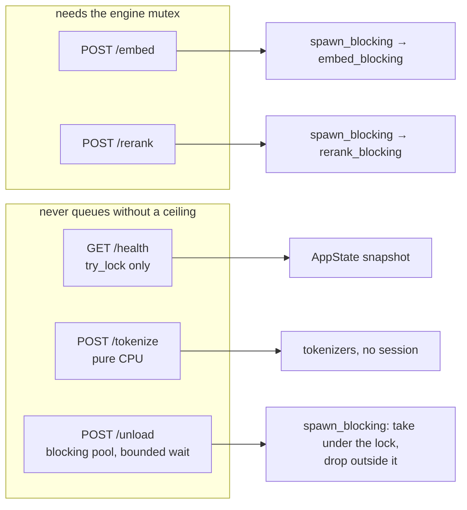

# Module — HTTP surface

> `src/main.rs`: the request/response records and the five handlers. The system as it is, 2026-08-16.

## Purpose

Be the whole API of this process — five routes, JSON in and out, on loopback — and make every answer say
what it does **not** know as clearly as what it does.

## Routes



## Wire shapes

### `POST /embed`

```jsonc
// request
{ "texts": ["…"], "kind": "doc" | "query", "provider": "auto|cuda|dml|migraphx|cpu",
  "max_length": 0, "max_batch": 0, "request_id": "" }

// response
{ "dense": [[0.1, …]], "sparse": [{ "indices": [u32], "values": [f32] }],
  "token_count": [123], "truncated": [false], "max_length": 256, "token_accounting": true,
  "request_id": "", "timings": { "queue_wait_ms": 0, "session_build_ms": 0,
                                 "inference_ms": 0, "compile_cache_grew_mb": 0 } }
```

`kind` is accepted for contract compatibility — BGE-M3 embeds queries and documents identically — but a
`query` is never allowed to move the loaded sequence cap, because it arrives interleaved with index
passes.

### `POST /rerank`

`{ query, documents[], provider?, max_batch?, request_id? }` → `{ scores[], request_id, timings }`.
Scores are sigmoid-normalised to 0…1 and returned **in document order**: `rerank()` returns them sorted
by score, while the C# consumer pairs by position.

### `POST /tokenize`

`{ texts[], model: "bge" | "qwen" }` → `{ token_count[], model, available }`. Pure CPU: a vocabulary
lookup and BPE merges, no session and no GPU, which is what makes it safe to call from inside an index
pass. An unknown model name is a `400` — a count from the wrong tokenizer is worse than no count. A text
the tokenizer **refuses** makes the whole answer `available: false` with an empty array: a `0` a caller
cannot tell from an empty text is worse than an honest "not measured".

### `GET /health`

Never blocks and never *computes*: every lock is a `try_lock` (a busy lock reads as "unknown yet", which
is honest), and the two provenance hashes are read from a cell a startup task filled on the blocking
pool. The first call used to SHA-256 the executable and every library beside it inline on a reactor
thread — 1.4 s over 67 MB of test binaries, and a CUDA deployment is gigabytes.

`status` is `"ok"` or `"wedged"` — deliberately not a constant, because the one failure that matters here
is an engine held past its ceiling by an ONNX Runtime call nothing can cancel:

| Field | Answers |
|---|---|
| `status` / `wedged` | The verdict. `wedged` is any engine past its phase's ceiling |
| `in_flight[]` | Per held engine: `engine`, `phase` (`building` \| `running`), `activity`, `elapsed_seconds`, `ceiling_seconds`, `wedged`. Empty when nothing holds an engine |
| `provenance_ready` | The two hashes are final. `false` = still being computed, so an empty hash means "not yet", not "unreadable" |

Plus four provider facts that a single field used to conflate:

| Field | Answers |
|---|---|
| `requested_provider` | What was asked for. Says nothing about whether it works |
| `compiled_providers` | What this binary was **built** with. A provider absent here can never become active, however it is configured |
| `active_provider` | The provider of a successfully created session; `null` until one exists |
| `provider_ready` / `last_provider_error` | Whether inference has ever succeeded, and the last registration failure verbatim |

Plus `exe_sha256` and `runtime_manifest_sha256` — so a benchmark can prove it measured the same binary
and the same provider libraries; `limits` (configured **and** `loaded_*`, the requested-versus-active
split again); `resident_embed_max_lengths`; and the resolved DXGI `adapter`.

### `POST /unload`

`{}` drains every resident rung; `{ "embed_max_lengths": [256], "rerank": true }` drops named ones. A
rung left behind would keep holding the card the lease is handing to something else. Engines are taken
under the lock and dropped **outside** it, in a blocking task, because session teardown takes a moment.

The lock is acquired on that same blocking task, with a ceiling (`UNLOAD_LOCK_WAIT_SECONDS`, 30 s). It
used to be taken directly on a Tokio **worker** thread: the operator's only recovery tool — which also
serves the host's GPU-lease coordinator — queued on the very mutex a hung request was holding, and with
Tokio's default worker count a handful of such calls starved the whole HTTP server, `/health` included.
The same file had already solved exactly this for `/health` (`loaded_now`); `/unload` was left behind.
An engine it could not take stays loaded, and the answer says so — `loaded` still reports it and
`in_flight[]` names what holds it, because a partial handover read as a complete one is how an exclusive
LLM ends up sharing the card.

## Fields that exist to prevent a specific wrong reading

| Field | Without it |
|---|---|
| `token_accounting: false` | A caller reads "no truncation reported" as "nothing was truncated". Truncation here is silent: an over-long input is embedded as a prefix, with no error and no warning |
| `truncated[]` | Same, per text |
| `loaded_max_batch` / `loaded_embed_max_length` | The configured default reads as a fact. It described an intention — "why 15 methods/s when the batch is 126?" produced three different numbers, none of them the one that ran |
| `timings.queue_wait_ms` | A request that waited behind another caller looks like a slow model |
| `activity` | A multi-minute first-build renders as a dead card in the host UI |
| `in_flight[].wedged` + `ceiling_seconds` | A stuck inference and a healthy cold compile look identical. The elapsed time alone cannot separate them — the ceiling has to travel with it |
| `provenance_ready` | An empty hash reads as "unreadable" when it only means "not hashed yet" |

## Error handling

`internal_error` → `500 { "error": … }`, logged with the full chain. `bad_request` → `400`.
`engine_error` → **`503`** for an `EngineWedged`: nothing is wrong with the request, the card is
unavailable right now, and a host that degrades or retries on `503` while treating `500` as a hard
failure can only act on the difference if we make it. The message carries the holder's activity, its
elapsed time and how to recover. A panicked blocking task is turned into a `500` naming the panic rather
than a dropped connection. Empty inputs short-circuit with an empty, well-formed answer and default
timings.

## Dependencies

- `axum` 0.8, `tokio` (`rt-multi-thread`, `macros`, `signal`), `serde`/`serde_json`, `bytes`.
- Binds `127.0.0.1:{PORT}` — `PORT` is injected by the AppHost, which owns the number so a consumer
  never guesses one. This machine runs several sidecars.
- The one confirmed .NET consumer is `dew_flow_rag_qln · SidecarClient` (`/health`, `/tokenize`,
  `/embed`). It does not call `/rerank` or `/unload`, and does not yet read `timings`.
