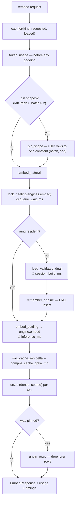

# Module — inference

> `src/main.rs`: `Engines`, `RungCache`, `Limits`, `embed_blocking`, `embed_natural`, `rerank_blocking`,
> `score_documents`, `pin_shape`, `embed_settling`. The system as it is, 2026-08-15.

## Purpose

Turn text into vectors and query–document pairs into scores, on a GPU, without rebuilding a model
session more often than the hardware forces.

Almost every non-obvious decision here is a workaround for one execution provider or one measured
failure. They are recorded in place because none of them is guessable from the code's shape.

## Flow

## Core structures

| Type | Role |
|---|---|
| `Engines` | Two mutex-guarded slots: `embed: Mutex<RungCache<Bgem3DualEmbedding>>`, `rerank: Mutex<Option<TextRerank>>` |
| `RungCache<T>` | One engine per `max_length` ("rung"), least-recently-**used** eviction, capacity from `EMBED_ENGINE_CACHE_RUNGS` |
| `Limits` | `max_length` (clamped 16…8192) and `max_batch` (≥ 1), resolved per request over the configured defaults |
| `PassTimings` | `queue_wait_ms`, `session_build_ms`, `inference_ms`, `compile_cache_grew_mb` |
| `TokenUsage` | `token_count[]`, `truncated[]`, effective `max_length`, `token_accounting` |
| `Bgem3DualEmbedding` | **One** session yielding both BGE-M3 heads per forward pass |
| `TextRerank` | The `bge-reranker-v2-m3` cross-encoder |

## Entry points

| Function | Purpose |
|---|---|
| `embed_blocking` | Owns capping, token accounting and shape pinning; delegates the pass |
| `embed_natural` | The pass itself: lock, build if needed, run, time each span |
| `rerank_blocking` / `score_documents` | The same shape for the cross-encoder; scores come back **in input order** |
| `cap_for(kind, requested, loaded)` | A `query` may never move the loaded cap — it arrives interleaved with index passes |
| `pin_shape` / `unpin_rows` | Splice ruler rows to one constant shape, then strip them |
| `embed_settling` | Re-runs the same batch when a freshly built session returns a short one |

## Measured decisions

| Decision | The measurement behind it |
|---|---|
| One session for both heads | The official FP32 export returns `sentence_embedding` and `token_embeddings` per run, so the dense/sparse split is post-processing rather than two sessions |
| **Not** the INT8 all-in-one model | Retrieval quality over speed — a locked decision |
| LRU cache, capacity ≥ 1 | A Fast lane walks the ladder down then up, crossing the boundary twice per pass; before the cache each crossing evicted both engines — ~5.5 min per pass, forever. Rebuilding one rung costs 156–173 s because MIGraphX re-materialises a ~2.4 GB program |
| Shape pinning under MIGraphX | Each distinct `(batch, seq)` compiles its own program: 92–162 s and +2.19 GB of cache apiece, measured 2026-07-30 |
| Settling retry, bounded to 3 | The first `session.run` on a fresh MIGraphX session returns short: at `(64, 1024)`, dense gave 80 rows for a 128-row input and the sparse head arrived shaped `[16, 1024, 1024]`. Every later run is correct |
| No throwaway warm-up | It charged an extra full-cap pass on every engine build, pushing a pass's first request to ~608 s past the host's 600 s budget — the pass "completed" with 0 methods embedded |
| Per-engine EP cache directory | The dense, sparse and rerank engines run the same graph at the same pinned shape, so the EP's cache key collided; a sparse session loaded another engine's program and died on `index < dim` (2026-07-27) |
| Rows zipped per text | The settling retry polices one length, so a short first run cannot shorten one head without the other |
| Timing spans measured separately | Queue wait and session build are both infrastructure wait, but the remedies differ — concurrency against warm-up — and one bucket for both explains neither |

## Dependencies

- `fastembed` (vendored, one marked patch in `sparse_text_embedding/impl.rs` — output selection by name
  for the MIGraphX EP), `ort`, `tokenizers`, `anyhow`, `tracing`.
- The GPU, through whichever execution provider was compiled in.
- `MODEL_CACHE_DIR` for weights; `ORT_MIGRAPHX_MODEL_CACHE_PATH` for compiled programs.

## Tests

Inline `#[cfg(test)] mod tests` in `main.rs`: the rung cache's hand-back, ladder walk, capacity-1
behaviour and LRU eviction order; `pin_shape`/`unpin_rows` round-tripping; `embed_settling` costing
exactly one run when settled; `aligned_scores` returning document order; `cap_for`; the pass log line;
and the `PassTimings` wire field names.
