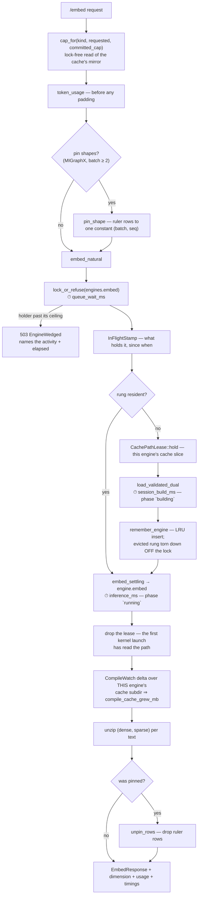

# Module — inference

> `src/inference.rs` (`embed_blocking`, `embed_natural`, `rerank_blocking`, `score_documents`,
> `pin_shape`, `embed_settling`, `lock_or_refuse`), `src/engine_cache.rs` (`RungCache`),
> `src/state.rs` (`Engines`, `Limits`), `src/compile_cache.rs` (`CompileWatch`, `CachePathLease`)
> and `src/bookkeeping.rs` (the recorders, `remember_engine`). The system as it is, 2026-08-16.

## Purpose

Turn text into vectors and query–document pairs into scores, on a GPU, without rebuilding a model
session more often than the hardware forces.

Almost every non-obvious decision here is a workaround for one execution provider or one measured
failure. They are recorded in place because none of them is guessable from the code's shape.

## Flow

## Core structures

| Type | Role |
|---|---|
| `Engines` | Two mutex-guarded slots — `embed: Mutex<RungCache<Bgem3DualEmbedding>>`, `rerank: Mutex<Option<TextRerank>>` — each paired with its own `Mutex<Option<InFlight>>` stamp, read **without** taking the engine |
| `InFlight` / `InFlightStamp` | The holder's phase, label and start instant; RAII, so `?` and panics clear it. The only thing that can see a wedge, because it lives outside the mutex the wedge is under |
| `WedgePolicy` | The ceilings: `building` 3600 s, `running` 900 s, `/unload` 30 s, poll 50 ms, opt-in process exit (default off) |
| `RungCache<T>` | One engine per `max_length` ("rung"), least-recently-**used** eviction, capacity from `EMBED_ENGINE_CACHE_RUNGS` |
| `Limits` | `max_length` (clamped 16…8192) and `max_batch` (≥ 1), resolved per request over the configured defaults |
| `PassTimings` | `queue_wait_ms`, `session_build_ms`, `inference_ms`, `compile_cache_grew_mb` |
| `CompileWatch` | A pass's growth in **one engine's own** cache subdirectory (`EMBED_CACHE_ENGINE` / `RERANK_CACHE_ENGINE`, shared with `CachePathLease` so builder and measurement cannot drift). Summing the whole tree charged a rerank compile to a concurrent embed pass — the engines hold independent mutexes, so concurrent is the ordinary case after a restart |
| `CachePathLease` | An RAII claim on the process-global MIGraphX cache path, for ONE engine. Taken by the caller that BUILDS and held across that engine's **first pass**, because the EP reads the path at the first kernel launch and not at session build. `load_dual`/`load_rerank` require one by type, and a lease held for the other engine is refused before anything is pinned or loaded. A resident engine claims nothing |
| `TokenUsage` | `token_count[]`, `truncated[]`, effective `max_length`, `token_accounting` |
| `Bgem3DualEmbedding` | **One** session yielding both BGE-M3 heads per forward pass |
| `TextRerank` | The `bge-reranker-v2-m3` cross-encoder |

## Entry points

| Function | Purpose |
|---|---|
| `embed_blocking` | Owns capping, token accounting and shape pinning; delegates the pass |
| `embed_natural` | The pass itself: lock, build if needed, run, time each span |
| `remember_engine` | Files a built engine under its rung and hands the EVICTED one to `teardown_off_the_lock` — an ort teardown done inline is paid by whoever is queued, and lands in their `queue_wait_ms` |
| `rerank_blocking` / `score_documents` | The same shape for the cross-encoder; scores come back **in input order** |
| `cap_for(kind, requested, committed)` | A `query` may never move the committed cap — it arrives interleaved with index passes |
| `commit_cap` / `settle_cap` / `committed_cap` | The cap this process is committed to: a resident rung, or the one a build is materialising. Written only under the engine lock, read without it (a query arriving mid-pass must not queue to learn which cap to use). See *A cap is a commitment* below |
| `pin_shape` / `unpin_rows` | Splice ruler rows to one constant shape, then strip them |
| `embed_settling` | Re-runs the same batch when a freshly built session returns a short one |
| `lock_or_refuse` | Every engine acquisition: heals poison, waits while the holder is alive, refuses (`503`) once it is wedged |
| `wedge_action` / `spawn_wedge_watchdog` | The verdict, and the log line that reports it without being asked |

## Measured decisions

| Decision | The measurement behind it |
|---|---|
| One session for both heads | The official FP32 export returns `sentence_embedding` and `token_embeddings` per run, so the dense/sparse split is post-processing rather than two sessions |
| **Not** the INT8 all-in-one model | Retrieval quality over speed — a locked decision |
| LRU cache, capacity ≥ 1 | A Fast lane walks the ladder down then up, crossing the boundary twice per pass; before the cache each crossing evicted both engines — ~5.5 min per pass, forever. Rebuilding one rung costs 156–173 s because MIGraphX re-materialises a ~2.4 GB program |
| Shape pinning under MIGraphX | Each distinct `(batch, seq)` compiles its own program: 92–162 s and +2.19 GB of cache apiece, measured 2026-07-30 |
| Settling retry, bounded to 3 | The first `session.run` on a fresh MIGraphX session returns short: at `(64, 1024)`, dense gave 80 rows for a 128-row input and the sparse head arrived shaped `[16, 1024, 1024]`. Every later run is correct |
| No throwaway warm-up | It charged an extra full-cap pass on every engine build, pushing a pass's first request to ~608 s past the host's 600 s budget — the pass "completed" with 0 methods embedded |
| Per-engine EP cache directory | The dense, sparse and rerank engines run the same graph at the same pinned shape, so the EP's cache key collided; a sparse session loaded another engine's program and died on `index < dim` (2026-07-27) |
| Rows zipped per text | The settling retry polices one length, so a short first run cannot shorten one head without the other |
| Timing spans measured separately | Queue wait and session build are both infrastructure wait, but the remedies differ — concurrency against warm-up — and one bucket for both explains neither |
| Wedge ceilings 900 s / 3600 s, not seconds | A first-ever shape compile is 214 s of CORRECT slowness, a first rerank pass 92–162 s, and the slowest honest first request on record ~608 s. A ceiling below those would refuse work that was about to succeed |
| The process-exit last resort is opt-in and OFF | Exiting mid-compile is exactly how a corrupt `.mxr` reaches the cache (2026-07-31), so the exit ceiling is measured **from the wedge verdict**, never from the phase start |
| The ruler string is one `OnceLock` allocation | ~110 KB rebuilt per pinned request and cloned per padding row — megabytes of allocator work per request, in the flavour that exists to avoid expensive work |

## A cap is a commitment, not an intention (2026-08-19)

`cap_for` decides which sequence cap a request runs at, and everything depends on the value handed to it
as *what is loaded*. That value used to come from a cell every `/embed` stamped with the cap it **asked
for** — written before the engine lock, before the cache lookup, before any build.

So a `doc` request at 1024 that was then refused (`503` behind a wedged engine) or that failed its canary
still left 1024 behind. The next `query` inherited a cap **nothing had ever been built at**, missed in the
cache, BUILT it — and at the shipped `EMBED_ENGINE_CACHE_RUNGS=1` that build evicted the rung the pass was
actively using. Precisely the thrash `cap_for` exists to prevent, arriving through its own argument. The
same field also outlived `/unload`: `/health` named a rung in a body whose `loaded.dense` said `false`.

What replaced it is an atomic mirror of the cache's occupancy, `AppState::committed_embed_cap`:

- **`commit_cap`** before a build, so a query arriving during a multi-minute compile inherits the cap that
  build is aiming at instead of asking for a second engine beside it.
- **`settle_cap`** on every path out of a build — success, failure, eviction, `/unload` — recomputing from
  `RungCache::caps()`. It takes the cache by reference, so a caller must be holding it: that is what makes
  "mirror" a fact rather than a hope.
- **Read lock-free**, because the decision happens *before* the engine lock is taken, and blocking there
  would break the same rule `/health`'s `try_lock` follows everywhere else.

Both directions are pinned by tests, and the second matters as much as the first: reading pure residency
instead of a commitment would have made a query arriving mid-build start a second engine.

## Dependencies

- `fastembed` (vendored, one marked patch in `sparse_text_embedding/impl.rs` — output selection by name
  for the MIGraphX EP), `ort`, `tokenizers`, `anyhow`, `tracing`.
- The GPU, through whichever execution provider was compiled in.
- `MODEL_CACHE_DIR` for weights; `ORT_MIGRAPHX_MODEL_CACHE_PATH` for compiled programs.

## Tests

Inline `#[cfg(test)] mod tests` in `main.rs`: the rung cache's hand-back, ladder walk, capacity-1
behaviour and LRU eviction order; `pin_shape`/`unpin_rows` round-tripping; `embed_settling` costing
exactly one run when settled; `aligned_scores` returning document order; `cap_for`; the pass log line;
and the `PassTimings` wire field names.

The wedge guards are tested with a held mutex and an `Instant` moved into the past — no GPU, no clock
abstraction: a wedged holder is refused within milliseconds and the message names it; a **healthy** cold
compile is still waited out (the counter-guarantee, and the reason the ceilings are minutes); an
unstamped hold still hits the fallback ceiling; poison still heals under the deadline; and the shipped
ceilings are asserted from the env defaults so a stray override cannot green them.
