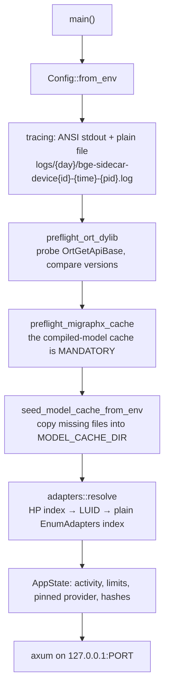

# Module — runtime and preflight

> `src/config.rs` (`Config`), `src/state.rs` (`AppState`), `src/main.rs` (`main`, `build_router`),
> `src/preflight.rs` (the `preflight_*` / `*_verdict` functions, `seed_model_cache_from_env`),
> `src/logging.rs`; and all of `src/adapters.rs`. As it is, 2026-08-16.

## Purpose

Decide what this process is before it serves anything: which execution provider, which GPU, which model
cache, which log file — and fail with a sentence that names the remedy rather than a stack trace.

The reason this is its own concern: **the execution provider is a compile-time feature.** Almost every
way this binary can be wrong is a mismatch between what it was built with, what it was configured with,
and what is installed beside it — and none of those is visible from a stack trace.

## Startup



Nothing loads a model at startup. The first `/embed` or `/rerank` builds the session it needs, which is
why `/health` reports `provider_ready: false` until one has succeeded.

## Configuration

Every knob is an environment variable, injected by the AppHost.

| Variable | Default | What it decides |
|---|---|---|
| `PORT` | 5320 | The bind port. The AppHost owns the number |
| `ORT_PROVIDER` | *(empty)* | `auto \| cuda \| dml \| migraphx \| cpu`. Empty ⇒ the first request's hint, else `auto`. An explicit choice **fails hard** rather than silently falling back to CPU |
| `ORT_DEVICE_ID` | 0 | GPU index in DXGI **high-performance order** (0 = fastest card) |
| `MAX_BATCH` | 64 | Default batch. Linear in the attention peak |
| `EMBED_MAX_LENGTH` | 256 | Default token cap. **The** memory driver — cost grows with its square |
| `RERANK_MAX_LENGTH` | 1024 | Independent of the embed cap; its documents are prose |
| `ORT_THREADS` | 0 | Intra-op threads (0 ⇒ ONNX Runtime decides) |
| `MODEL_CACHE_DIR` | `.model-cache` | Where weights live — gigabytes, belonging to the machine rather than to a build output |
| `QWEN_TOKENIZER` | `../qwen-tokenizer/tokenizer.json` | Counting only; no Qwen model is ever loaded |
| `PIN_INPUT_SHAPE` | `auto` | `auto` ⇒ on for MIGraphX only |
| `ORT_MIGRAPHX_MODEL_CACHE_PATH` | *(empty)* | The compiled-program cache root |
| `EMBED_ENGINE_CACHE_RUNGS` | 1 | How many sequence caps stay resident |
| `SIDECAR_LOG_DIR` | `logs` | Log root |
| `SIDECAR_LOG_RETENTION_DAYS` | 14 | Day folders older than this go at startup; **0 keeps everything** |
| `RUST_LOG` | — | Level |

`MAX_BATCH` deserves a note: the AppHost passes it as an **empty string**, so the default above is what
a real deployment runs on until a request overrides it. The old default of 4 silently re-batched a
126-text call into 32 forward passes.

## Preflight checks

| Check | What it catches |
|---|---|
| `preflight_ort_dylib` / `probe_ort_dylib` / `dylib_verdict` | The ONNX Runtime beside the exe is a different API version than `ort` was built against. Names the required and found versions — the failure this replaces was a **deadlock** inside `ort`'s `OnceLock` on the version-fail path, which presents as a hang, not an error |
| `preflight_migraphx_cache` / `cache_dir_verdict` | The compiled-model cache path is unset or unwritable. Mandatory under MIGraphX: without it every run recompiles for minutes |
| `seed_model_cache_from_env` / `copy_missing_files` | Weights are missing from the cache. Copies what is absent, repairs a truncated earlier copy, and skips what is already there |
| `adapters::resolve` / `map_device` | The device id means a different card than the operator picked |

## The compiled-model cache slice — one per engine AND one per shape (2026-08-19)

Under MIGraphX the compiled-model cache is mandatory, and its layout is a correctness matter rather than a
tidiness one. **The EP's own cache key distinguishes neither the engine nor the input shape**, so a session
can load a program that was compiled for something else, load it cleanly, and return a mis-shaped tensor
minutes later. Two incidents establish this:

| date | what collided | what it looked like |
|---|---|---|
| 2026-07-27 | the ENGINE (dense / sparse / rerank run the same graph at the same pinned shape) | a sparse session died on `assertion failed: index < dim` |
| 2026-08-19 | the SEQUENCE LENGTH | a session built for `max_length` 256 was served programs compiled for 128 and then 224 — both already in `dual/`, one from the previous day — returning `token_embeddings` shaped `[64, 128, 1024]` and `[64, 224, 1024]` against an input of 64x256 |

The 2026-08-19 cost, measured on a full aspnetcore index pass: the canary rejected two runs, gave up, wiped
the slice and recompiled — **213.7 s**, against **5.1 s** for the same step on DirectML. The sequence ladder's
step down to cap 128 then paid another **127 s** the same way. Together **341 s against 9 s**, all of it inside
the embed wall, which is why it had been read as a slow vector-store write path
(`dew_flow_rag_qln` research/GPU_BACKEND_WSL_VS_WINDOWS.md §10).

So the slice carries the engine **and** the shape: `dual-b64s256`, `dual-b64s128`, `rerank-s1024`. The rule is
one sentence — **a cache hit must mean "my program, at my shape", or it must miss** — and a miss forces a
compile, which is the only correct answer. Never a program that is close.

Both dimensions, because an `/embed` request may override either (`Limits::resolve`); an engine whose batch is
not pinned at build time (the reranker takes whatever the request brings) is spelled without one rather than
with an invented `b0`. `CachePathLease` remembers the shape it was taken for and `load_session` refuses a
build at any other, so a mismatched claim is one sentence at the call site instead of a canary failure and a
heal minutes later.

**Migration.** The first run after this change finds empty slices and recompiles each resident rung once. The
previous flat `dual/` and `rerank/` directories are then orphaned — they are exactly the programs with mixed
shapes in them, and deleting them by hand is safe once a run has succeeded.

**Verified on the WSL sidecar, 2026-08-19, and the old cache was worse than no cache:**

| slice state | stall | canary |
|---|---|---|
| before, "warm" — a program of the WRONG shape | **213.7 s** (cap 256) + 127.0 s (cap 128) | rejected twice, slice wiped, recompiled |
| after, EMPTY slice — an honest first compile | 108.3 s + 103.3 s | **accepted on run 1** |
| after, WARM slice | **25.9 s** + 30.0 s | **accepted on run 1** |

A pass on that arm now pays **55.9 s** of engine stall where it paid **340.9 s**. The tree afterwards is
`dual-b64s128` (2 280 MB) and `dual-b64s256` (2 396 MB) beside the orphaned flat `dual` (4 675 MB).

## The DXGI mapping, and why it exists

`src/adapters.rs` (Windows-only, `#[cfg(windows)]`) translates the operator's device index into what the
DirectML EP actually consumes:

```
high-performance index  →  adapter LUID  →  plain EnumAdapters index
```

The legacy DML EP counts adapters in **plain enumeration order**, which usually lists the display or
integrated adapter first, while the host UI numbers them in high-performance order (0 = fastest).
Feeding the raw id straight through ran inference on the wrong card. CUDA gets the raw id — its own
numbering. When DXGI cannot resolve it, `/health.adapter` is `null` and the raw id is passed through:
an unresolved mapping is reported, not guessed.

`ResolvedAdapter` carries the name, `vram_mb` (**total capacity**, sampled once — not a live reading),
the LUID, the requested device and the resolved DML id.

The same module also owns the one memory question DXGI can answer about US rather than about the machine:
`process_vram_bytes(plain_index)` is `IDXGIAdapter3::QueryVideoMemoryInfo` for the LOCAL segment, i.e. how
many bytes **this process** currently holds on that adapter. It takes the resolved plain index, so the
sample is taken against the card the engines actually run on, and it is gated on a resolved adapter: with
no resolution the sidecar passes the raw id to the EP, and an id DXGI could not map is one this sampler
must not pretend to understand either. `None` on every failure and on every non-Windows build — never a
zero, because a process holding no VRAM and a process that could not be asked are different facts. What
consumes it is `src/vram.rs` (see [PLAN_vram_per_engine.md](PLAN_vram_per_engine.md)).

## AppState

| Field | Purpose |
|---|---|
| `activity` | One free-text line — `"idle"`, `"embed: waiting for the engine"`, `"embed: building and canary-checking the session…"` — polled through `/health` so a host UI can show "compiling models" instead of a dead card during a multi-minute first build. One slot, last writer wins |
| `pinned_provider` | The provider of the first successful session, fixed until restart |
| `committed_embed_cap` / `loaded_max_batch` | What actually ran, as opposed to what was configured. The cap is an atomic mirror of the engine cache's occupancy — written under that lock, read without it; see *A cap is a commitment* in [module_inference.md](module_inference.md) |
| `vram` | What each engine's BUILD cost on the adapter, and how many samples were discarded as unattributable |
| `active_provider` / `last_provider_error` | Filled by session creation; read by `/health` with `try_lock` |
| `exe_sha256` / `runtime_manifest_sha256` | Identity of the binary and of the provider libraries beside it |

## Dependencies

- `windows` crate (DXGI) on Windows only; `sha2` for the identity hashes; `tracing-subscriber` for the
  two logging layers.
- The AppHost in `dew_flow_rag_qln` launches this as an **executable, not a container** — the point is
  the GPU, and it is compiled on the machine it runs on. It is registered `isProxied: false`: through
  the orchestrator's endpoint proxy a first `/embed` died with "the response ended prematurely", because
  a cold DirectML build compiles on that first call and the proxy closes the connection.

## Tests

Inline: `compiled_providers` matching the build flavour, an uncompiled provider refused with a rebuild
instruction, `auto`/`cpu` never refused, provider-token resolution (env wins, unknown degrades to
`auto`), the dylib and cache verdicts including the version-mismatch message, model-cache seeding
(empty target, partial copy, truncated repair), and `map_device`'s ordering contract without DXGI.
