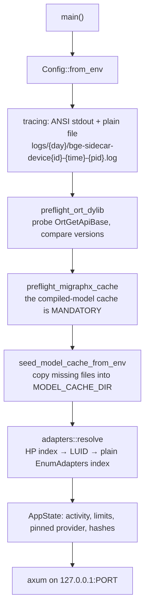

# Module — runtime and preflight

> `src/main.rs`: `Config`, `AppState`, `main`, the `preflight_*` and `*_verdict` functions,
> `seed_model_cache_from_env`, logging setup; and all of `src/adapters.rs`. As it is, 2026-08-15.

## Purpose

Decide what this process is before it serves anything: which execution provider, which GPU, which model
cache, which log file — and fail with a sentence that names the remedy rather than a stack trace.

The reason this is its own concern: **the execution provider is a compile-time feature.** Almost every
way this binary can be wrong is a mismatch between what it was built with, what it was configured with,
and what is installed beside it — and none of those is visible from a stack trace.

## Startup



Nothing loads a model at startup. The first `/embed` or `/rerank` builds the session it needs, which is
why `/health` reports `provider_ready: false` until one has succeeded.

## Configuration

Every knob is an environment variable, injected by the AppHost.

| Variable | Default | What it decides |
|---|---|---|
| `PORT` | 5320 | The bind port. The AppHost owns the number |
| `ORT_PROVIDER` | *(empty)* | `auto \| cuda \| dml \| migraphx \| cpu`. Empty ⇒ the first request's hint, else `auto`. An explicit choice **fails hard** rather than silently falling back to CPU |
| `ORT_DEVICE_ID` | 0 | GPU index in DXGI **high-performance order** (0 = fastest card) |
| `MAX_BATCH` | 64 | Default batch. Linear in the attention peak |
| `EMBED_MAX_LENGTH` | 256 | Default token cap. **The** memory driver — cost grows with its square |
| `RERANK_MAX_LENGTH` | 1024 | Independent of the embed cap; its documents are prose |
| `ORT_THREADS` | 0 | Intra-op threads (0 ⇒ ONNX Runtime decides) |
| `MODEL_CACHE_DIR` | `.model-cache` | Where weights live — gigabytes, belonging to the machine rather than to a build output |
| `QWEN_TOKENIZER` | `../qwen-tokenizer/tokenizer.json` | Counting only; no Qwen model is ever loaded |
| `PIN_INPUT_SHAPE` | `auto` | `auto` ⇒ on for MIGraphX only |
| `ORT_MIGRAPHX_MODEL_CACHE_PATH` | *(empty)* | The compiled-program cache root |
| `EMBED_ENGINE_CACHE_RUNGS` | 1 | How many sequence caps stay resident |
| `SIDECAR_LOG_DIR` | `logs` | Log root |
| `RUST_LOG` | — | Level |

`MAX_BATCH` deserves a note: the AppHost passes it as an **empty string**, so the default above is what
a real deployment runs on until a request overrides it. The old default of 4 silently re-batched a
126-text call into 32 forward passes.

## Preflight checks

| Check | What it catches |
|---|---|
| `preflight_ort_dylib` / `probe_ort_dylib` / `dylib_verdict` | The ONNX Runtime beside the exe is a different API version than `ort` was built against. Names the required and found versions — the failure this replaces was a **deadlock** inside `ort`'s `OnceLock` on the version-fail path, which presents as a hang, not an error |
| `preflight_migraphx_cache` / `cache_dir_verdict` | The compiled-model cache path is unset or unwritable. Mandatory under MIGraphX: without it every run recompiles for minutes |
| `seed_model_cache_from_env` / `copy_missing_files` | Weights are missing from the cache. Copies what is absent, repairs a truncated earlier copy, and skips what is already there |
| `adapters::resolve` / `map_device` | The device id means a different card than the operator picked |

## The DXGI mapping, and why it exists

`src/adapters.rs` (Windows-only, `#[cfg(windows)]`) translates the operator's device index into what the
DirectML EP actually consumes:

```
high-performance index  →  adapter LUID  →  plain EnumAdapters index
```

The legacy DML EP counts adapters in **plain enumeration order**, which usually lists the display or
integrated adapter first, while the host UI numbers them in high-performance order (0 = fastest).
Feeding the raw id straight through ran inference on the wrong card. CUDA gets the raw id — its own
numbering. When DXGI cannot resolve it, `/health.adapter` is `null` and the raw id is passed through:
an unresolved mapping is reported, not guessed.

`ResolvedAdapter` carries the name, `vram_mb` (**total capacity**, sampled once — not a live reading),
the LUID, the requested device and the resolved DML id.

## AppState

| Field | Purpose |
|---|---|
| `activity` | One free-text line — `"idle"`, `"embed: waiting for the engine"`, `"embed: building and canary-checking the session…"` — polled through `/health` so a host UI can show "compiling models" instead of a dead card during a multi-minute first build. One slot, last writer wins |
| `pinned_provider` | The provider of the first successful session, fixed until restart |
| `loaded_embed_max_length` / `loaded_max_batch` | What actually ran, as opposed to what was configured |
| `active_provider` / `last_provider_error` | Filled by session creation; read by `/health` with `try_lock` |
| `exe_sha256` / `runtime_manifest_sha256` | Identity of the binary and of the provider libraries beside it |

## Dependencies

- `windows` crate (DXGI) on Windows only; `sha2` for the identity hashes; `tracing-subscriber` for the
  two logging layers.
- The AppHost in `dew_flow_rag_qln` launches this as an **executable, not a container** — the point is
  the GPU, and it is compiled on the machine it runs on. It is registered `isProxied: false`: through
  the orchestrator's endpoint proxy a first `/embed` died with "the response ended prematurely", because
  a cold DirectML build compiles on that first call and the proxy closes the connection.

## Tests

Inline: `compiled_providers` matching the build flavour, an uncompiled provider refused with a rebuild
instruction, `auto`/`cpu` never refused, provider-token resolution (env wins, unknown degrades to
`auto`), the dylib and cache verdicts including the version-mismatch message, model-cache seeding
(empty target, partial copy, truncated repair), and `map_device`'s ordering contract without DXGI.
